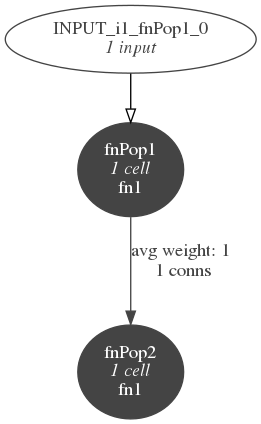

# Example of FitzHugh Nagumo network in NeuroML 

Simple example of network in NeuroML, which can potentially be mapped to the equivalent in PsyNeuLink

## Network:



Definition of network structure in NeuroML2:

[FitzHughNagumoNetwork.net.nml](FitzHughNagumoNetwork.net.nml)

Definition of the behaviour of the cell & synapse in LEMS:

[FN_Definitions.xml](FN_Definitions.xml)

Description of a simulation using LEMS Simulation:

[LEMS_FitzHughNagumo.xml](LEMS_FitzHughNagumo.xml)

Summary of structure in JSON (so called DLEMS, or distilled LEMS format):

[LEMS_FitzHughNagumo.json](LEMS_FitzHughNagumo.json)

## To run

### Use pyNeuroML

This is a Python wrapper for the Java based LEMS simulator/reference implementation. For installation instructions see https://github.com/NeuroML/pyNeuroML. 

It will install the command line utility **pynml**.

```
    pynml LEMS_FitzHughNagumo.xml
```


### Use PyLEMS

This is a pure Python LEMS simulator. See https://github.com/LEMS/pylems. **Note: also install https://github.com/NeuroML/NeuroML2.**

It will install the command line utility **pylems**.

```
     pylems -I ~/NeuroML2/NeuroML2CoreTypes/  LEMS_FitzHughNagumo.xml
```

